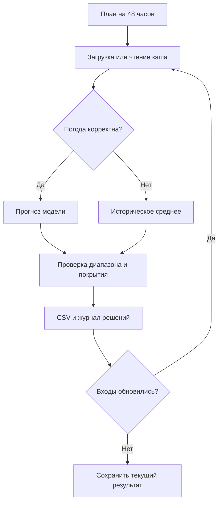

# Как работает прогноз

## Данные и целевая величина

CSV первой турбины содержит 142 360 записей, второй — 149 499. Период: 11 марта 2023 — 31 января 2026. Шаг измерений — 10 минут. Февраль в названиях файлов не соответствует их фактическому содержимому.

Один обучающий пример соответствует часу одной турбины. Цель — среднее шести нормализованных значений активной мощности. Час с неполными, некорректными или отсутствующими измерениями исключается из обучения. Пропуски не заменяются нулями. Нулевое реальное измерение остаётся нулём.

| Турбина | Координаты | Полные часы | Отсутствующие десятиминутные слоты |
|---|---|---:|---:|
| 1 | 43.645150, 78.535604 | 23 667 | 9 992 |
| 2 | 43.643198, 78.538828 | 24 785 | 2 853 |

Координаты взяты из существующего проекта; ссылки организаторов: [турбина 1](https://maps.app.goo.gl/iN6svMt69D5qRpFU9), [турбина 2](https://maps.app.goo.gl/8UQMwsYavY6nLvFY8). Часовой пояс в CSV отсутствует. Пока принят UTC+5. Погодные признаки присоединяются только с апреля 2024 года, чтобы не применять один постоянный сдвиг к периоду до изменения гражданского времени Казахстана. Более ранняя история участвует в расчёте собственного исторического среднего SCADA.

## Разделение по времени

Все отсечки учитывают **конец** измеряемого часа. Например, значение с меткой 22:00 считается известным в 23:00. Значение с меткой 23:00 в этот момент ещё неизвестно.

| Этап | Какие завершившиеся измерения доступны |
|---|---|
| Обучение трёх кандидатов | До первого декабрьского выпуска: 30.11.2025 23:00 |
| Выбор параметров на декабре | Только цели, завершившиеся к 31.12.2025 23:00 |
| Обучение выбранной точечной модели | До 31.12.2025 23:00; последняя метка цели 22:00 |
| Независимая проверка точечного прогноза | Январь 2026, без подбора параметров по его результатам |
| Калибровка диапазонов | Январские ошибки для целей, завершившихся к 31.01.2026 23:00 |
| Итоговый исторический расчёт | Выпуски с 31.01 по 28.02.2026, модель зафиксирована |

Модель `HistGradientBoostingRegressor` использует прогноз ветра на 80 м, температуру на 2 м, направление ветра, час, месяц, давность погодного прогноза и идентификатор турбины. Направление и циклическое время кодируются синусом и косинусом. Будущая фактическая мощность и будущий фактический ветер из SCADA в признаки не входят.

Базовые методы: историческое среднее до отсечки и последнее завершившееся доступное измерение (persistence). Метрики считаются на одинаковых целях. Отчёт показывает количество запланированных строк, отсутствующих целей и резервных прогнозов. Неполная погода не скрывается удалением сложных примеров из оценки.

`lower90` и `upper90` используют 90-й процентиль абсолютных январских ошибок, отдельно по турбине и группе горизонта. Это эмпирические диапазоны без гарантии покрытия. При резервном прогнозе диапазон равен [0, 1].

## Как выбирается погода

Источник: [Open-Meteo Previous Runs API](https://open-meteo.com/en/docs/previous-runs-api), `gfs_seamless`. Запросы используют GMT и м/с. Кэш хранится по полным календарным месяцам отдельно для каждой турбины.

Для горизонта `h` выбирается `d = ceil((h + 12) / 24)`. При задержке из настроек 12 часов:

| Горизонт | Ряд |
|---|---|
| 1–12 часов | previous_day1 |
| 13–36 часов | previous_day2 |
| 37–48 часов | previous_day3 |

Проверяется расчётное неравенство `valid_time - d * 24 часа + 12 часов <= issue_time`.

**Это проверка допущения, а не доказательство фактической публикации.** API фиксированных давностей не предоставляет ID каждого исходного выпуска и его историческое время доступности. Поле `availability_bound_utc` нельзя трактовать как наблюдаемую дату публикации. Значение `historical_availability_verified` в отчёте равно `false`.

Документация [Single Runs API](https://open-meteo.com/en/docs/single-runs-api) различает инициализацию модели и публикацию результата. В этом сервисе отдельные GFS-выпуски за февраль 2026 недоступны: архив большинства моделей начинается в апреле 2026. ECMWF для более раннего периода описан как hindcasts — его нельзя без дополнительной проверки выдавать за прогноз, действительно опубликованный тогда. Поэтому адаптер не подменён таким источником автоматически.

Для строгого выполнения требования организаторов нужен архив оперативных выпусков и подтверждение доступности их файлов к моменту расчёта. Включение `--require-verified-availability` сейчас завершает команду ошибкой до публикации результата.

## Решения агента

Агент реализован как контроллер на правилах с ML-моделью и инструментами. Он сам получает внешние данные, выбирает обычный или резервный прогноз и проверяет результат. LLM не используется, свободное планирование не заявляется. `watch` проверяет отпечатки модели, кода, конфигурации и погодных значений; при их совпадении численный расчёт пропускается.

Перед заменой кэша проверяются UTC, все единицы измерения, длины массивов и почасовые метки. Ошибка обновления сохраняет предыдущий валидный файл. При воспроизведении повреждённый файл помечается в журнале и исключается; при обучении приводит к явной ошибке.

## Как читать результат

Каждый выпуск создаётся в 23:00 местного времени. Первый прогнозный час начинается в 00:00 следующих суток. Полная таблица сохраняет пересекающиеся 48-часовые горизонты как разные прогнозы. Для февральской подачи выбираются только первые 24 часа каждого выпуска: один прогноз на каждую пару «турбина, час».

Нормализованные значения двух турбин нельзя просто складывать и называть МВт. При известных номинальных мощностях `C1` и `C2` и подтверждённой нормализации по ним энергия за час равна `(p1*C1 + p2*C2) * 1 час`. Пока доступно только явно названное среднее при допущении `C1=C2`.

## Воспроизводимость

Версии зависимостей зафиксированы в `requirements.txt`. Кэш имеет контрольные суммы и дату скачивания. Дата скачивания не считается историческим временем публикации. Модель сохраняет настройки и дату, с которой её калибровка допустима. Команда `package` проверяет соответствие текущей модели, кода и настроек последнему полному расчёту и обновляет контрольные суммы.

Сеть нужна при первой загрузке. Тесты выполняются без сети. Повторный расчёт на том же кэше и с теми же версиями воспроизводит метод; внешний сервис может менять архив, поэтому для точного повторения нужно сохранить сам кэш, а не только манифест.
